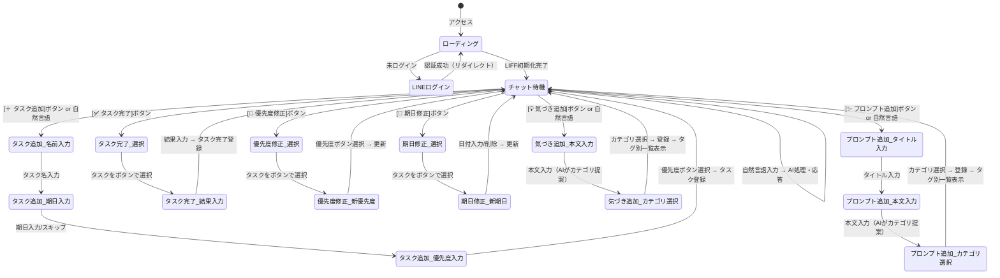

# 画面仕様書 — BrainDump

## 改訂履歴

| 版 | 日付 | 内容 |
|----|------|------|
| 1.0 | 2026-05-23 | 初版 |
| 1.1 | 2026-05-24 | クイックアクション7種・優先度バッジ・ガイドフロー遷移図を追加 |
| 2.0 | 2026-05-24 | LINEプロフィール表示・音声入力ボタン・ローディング画面・ボタン並び順改訂 |
| 3.0 | 2026-05-30 | ヘッダー法人名・組織ウィザード・運営コンソール・0段対応 |
| 4.0 | 2026-06-15 | プロンプト追加ボタン・タグ別構造化リスト・8ボタン化 |

---

## 1. 画面構成

BrainDump のメインは単一画面（SPA）です。加えて運営コンソール・組織管理オーバーレイがあります。

| 画面 | ファイル |
|------|----------|
| SCR-01 チャット（LIFF） | `app/index.html` |
| SCR-02 組織管理オーバーレイ | `app/org-admin.js` + `#org-overlay` |
| SCR-03 運営コンソール | `app/platform-console.html` |

```
┌──────────────────────────────┐
│      ①ヘッダー                │  固定
├──────────────────────────────┤
│      ②クイックアクション       │  固定
├──────────────────────────────┤
│                              │
│      ③チャットエリア           │  スクロール可
│                              │
├──────────────────────────────┤
│      ④入力フッター              │  固定
└──────────────────────────────┘

（初期化中のみ）
┌──────────────────────────────┐
│      ⑤ローディングオーバーレイ  │  全画面
└──────────────────────────────┘
```

---

## 2. 各エリア仕様

### ① ヘッダー

| 要素 | 説明 |
|------|------|
| ロボットアイコン | `🤖` テキスト絵文字 |
| アプリ名 | "BrainDump" |
| サブタイトル | "Supabase × OpenAI" |
| 組織管理 ⚙️ | `#btn-org-admin`。`org_admin` かつ（`pending_setup` または 1〜3段）で表示。0段設定完了後は非表示 |
| 法人名 | `#header-org-name`（`organizations.name`）。法人所属時のみ |
| ユーザー名 | LINE `displayName` |
| ユーザーアイコン | LINEプロフィール画像（丸型 32px） |

右端の並び（左→右）: **⚙️（条件付き）** → **法人名** → **表示名** → **アイコン**

```
┌──────────────────────────────────────────────────┐
│ 🤖 BrainDump              ⚙️ TAKEBYPLACE 山田 [●] │
│    Supabase × OpenAI                             │
└──────────────────────────────────────────────────┘
```

`auth/me` 取得後に `refreshMemberContext()` で法人名を更新する。

### ② クイックアクションエリア

8つのボタンを折り返し表示します。

| 行 | ボタン | 表示ラベル |
|----|--------|----------|
| 1行目 | タスク追加 | `＋ タスク追加` |
| 1行目 | タスク一覧 | `📋 タスク一覧` |
| 1行目 | タスク完了 | `✅ タスク完了` |
| 1行目 | 気づき追加 | `💡 気づき追加` |
| 1行目 | プロンプト追加 | `✨ プロンプト追加` |
| 2行目 | 気づきエクスポート | `📤 気づきエクスポート` |
| 2行目 | 優先度修正 | `🔄 優先度修正` |
| 2行目 | 期日修正 | `📅 期日修正` |

スタイル: 背景色 `#f0f0f0`・ボーダーあり・フォント小・折り返し有効

### ③ チャットエリア

- ユーザーメッセージ: 右寄せ・緑背景（LINE風）
- ボットメッセージ: 左寄せ・白背景
- タイピングインジケーター: 「…」3点アニメーション（AI応答待ち中）
- タスクリスト表示: 優先度バッジ付きリスト（`addTaskListMessage`）
- 気づきリスト表示: タグバッジ＋本文抜粋＋日付（`addInsightListMessage`）
- プロンプトリスト表示: タグバッジ＋タイトル＋本文抜粋＋日付（`addPromptListMessage`）
- 選択ボタン群: 候補をボタン一覧として表示（ガイドフロー用）
- 日付セパレーター: 日をまたぐメッセージ間に `2026-05-24` 形式で表示

#### 優先度バッジ

| 優先度 | 背景色 | テキスト色 |
|--------|--------|-----------|
| 高 | `#fdecea`（薄赤） | `#c62828`（赤） |
| 中 | `#fff8e1`（薄黄） | `#f57f17`（橙） |
| 低 | `#e8f5e9`（薄緑） | `#2e7d32`（緑） |

#### タグバッジ（気づき・プロンプト）

| タグ例 | 用途 |
|--------|------|
| アイデア / 仕事 / 学び / 日常 / その他 | 気づき用 |
| 文章作成 / コーディング / 分析 / 要約 / その他 | プロンプト用 |

登録後の標準一覧は、選択タグで絞り込んだ構造化リストとして表示する。

### ④ 入力フッター

- テキストエリア: 可変高さ（最大4行）・日本語入力対応・Shift+Enterで改行
- 音声入力ボタン（🎤）: タップで録音開始/停止。録音中は赤くパルスアニメーション
- 送信ボタン（→）: メッセージ送信。空文字時は無効

```
┌──────────────────────────────┐
│ [テキストエリア]  [🎤] [→]   │
└──────────────────────────────┘
```

### ⑤ ローディングオーバーレイ

- LIFF SDKの初期化中（`liff.init()` 実行中）に全画面表示
- スピナーアニメーション + "読み込み中..." テキスト
- 初期化完了後に非表示になり、チャット画面が現れる

---

## 3. 音声入力ボタン 状態遷移

```
[待機中]
  ・🎤 ボタン（通常色）
  ・タップ → 録音開始
       ↓
[録音中]
  ・🎤 ボタン（赤・パルスアニメーション）
  ・話すと途中結果がテキストエリアに反映
  ・無音でも自動停止せず継続（continuous=true）
  ・タップ → 録音停止（確定テキストがテキストエリアに残る）
       ↓
[待機中] ← 任意のタイミングで再開可能
```

---

## 4. 画面遷移・UIフロー（Mermaid）



---

## 5. ガイドフロー詳細

### 5.1 タスク追加フロー

```
ボット: 「タスク名を入力してください」
ユーザー: [タスク名] or 任意のテキスト
  ↓
ボット: 「期日を教えてください（例：2026-06-01）スキップするには"なし"と入力」
ユーザー: 日付 or "なし"
  ↓
ボット: 「優先度を選んでください」 + [高][中][低] ボタン
ユーザー: ボタン選択
  ↓
ボット: タスク登録完了メッセージ
```

### 5.2 タスク完了フロー

```
[タスク完了] ボタン → GET /api/tasks（未完了タスク取得）
  ↓
ボット: 「完了するタスクを選んでください」 + [タスクA][タスクB]...ボタン
ユーザー: タスクをボタンで選択
  ↓
ボット: 「完了時の結果・成果を入力してください（スキップ可）」
ユーザー: 結果テキスト or "スキップ"
  ↓
ボット: タスク完了登録メッセージ
```

### 5.3 優先度修正フロー

```
[優先度修正] ボタン → GET /api/tasks（未完了タスク取得）
  ↓
ボット: 「優先度を変更するタスクを選んでください」 + [タスクA][タスクB]...ボタン
ユーザー: タスクをボタンで選択
  ↓
ボット: 「新しい優先度を選んでください」 + [高][中][低] ボタン
ユーザー: ボタン選択
  ↓
ボット: 優先度更新完了メッセージ
```

### 5.4 期日修正フロー

```
[期日修正] ボタン → GET /api/tasks（未完了タスク取得）
  ↓
ボット: 「期日を変更するタスクを選んでください」 + [タスクA][タスクB]...ボタン
ユーザー: タスクをボタンで選択
  ↓
ボット: 「新しい期日を入力してください（例：2026-06-15）削除する場合は"なし"」
ユーザー: 日付テキスト or "なし"
  ↓
ボット: 期日更新完了メッセージ
```

### 5.5 気づき追加フロー

```
ボット: 「気づき・学びの内容を入力してください」
ユーザー: 気づきのテキスト
  ↓
ボット（AIカテゴリ提案）: 「カテゴリを選んでください（複数可）」 + [カテゴリA][カテゴリB]...[＋カスタム追加]ボタン
ユーザー: カテゴリ選択 + [決定] ボタン
  ↓
ボット: 気づき登録完了メッセージ + タグ別気づき一覧（標準表示）
```

### 5.6 プロンプト追加フロー

```
ボット: 「プロンプトのタイトルを入力してください」
ユーザー: タイトル
  ↓
ボット: 「プロンプト本文を入力してください」
ユーザー: 本文
  ↓
ボット（AIカテゴリ提案）: 「カテゴリを選んでください（複数可）」 + ボタン群
ユーザー: カテゴリ選択 + [決定]
  ↓
ボット: プロンプト登録完了メッセージ + タグ別プロンプト一覧（標準表示）
```

---

## 6. タスク一覧 表示フォーマット

```
📋 **未完了タスク一覧** (3件)

┌─────────────────────────────────────┐
│ [高] 企画書を作成する         2026-05-28 │
│ [中] 会議資料を準備する       2026-06-01 │
│ [低] 読書メモをまとめる       期限なし   │
└─────────────────────────────────────┘
```

- 優先度バッジはテーブルセル内に背景色付きで表示
- 期限日がある場合は YYYY-MM-DD 形式で表示
- 期限なしの場合は「期限なし」と表示
- 期限切れ（今日以前）の場合は日付を赤字で表示

---

## 7. スタイルガイド

| 要素 | 値 |
|------|-----|
| フォント | system-ui / -apple-system（OSデフォルト） |
| ベース背景色 | `#e5ddd5`（LINE風グレー） |
| ユーザーバブル | 背景 `#dcf8c6`（薄緑） |
| ボットバブル | 背景 `#ffffff`（白） |
| クイックアクションボタン | 背景 `#f0f0f0`・ボーダー `#ccc` |
| 録音中ボタン | 背景 `#ff4444`・パルスアニメーション |
| 最大コンテンツ幅 | 480px（モバイルファースト） |

---

## 8. SCR-02 組織管理オーバーレイ

| 項目 | 内容 |
|------|------|
| 起動 | ヘッダー ⚙️、または `pending_setup` 時の自動表示 |
| 初回ウィザード | 0 / 1 / 2 / 3 段選択 → 部門名入力（0段は部門なし）→ 利用規約同意 → 保存 |
| 0段 | 「代表者のみ」選択後、招待 UI なし。保存後 ⚙️ 非表示 |
| 招待タブ | 1〜3段・設定完了後。ロール別招待 URL 発行 |
| 表示制御 | オーバーレイは `is-open` クラスでパネルとマスクを同期表示 |
| 事後変更 | 段数・ツリーの変更 UI は**なし** |

---

## 9. SCR-03 運営コンソール

| 項目 | 内容 |
|------|------|
| URL | `/app/platform-console.html` |
| 認証 | シークレット入力 → ローカルセッション |
| 法人登録フォーム | 名称・住所・電話・代表氏名 |
| 招待 URL | 成功時に**目立つ URL 表示＋コピー**。詳細 JSON は折りたたみ |
| 法人一覧 | 名称・status・**階層 0〜3 段ラベル** |

詳細: [09_Phase1_マルチテナント.md](09_Phase1_マルチテナント.md)
