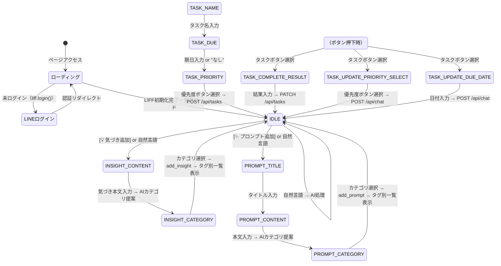

# UIフロー仕様書 — BrainDump

## 改訂履歴

| 版 | 日付 | 内容 |
|----|------|------|
| 1.0 | 2026-05-23 | 初版（ステートマシン・各フロー詳細） |
| 1.1 | 2026-05-24 | タスク完了・優先度/期日修正フロー追加。Mermaid図更新 |
| 2.0 | 2026-05-24 | LIFF認証フロー・タスク選択ボタン方式・音声入力フローを追加 |
| 3.0 | 2026-05-30 | タスク一覧 API 直取得・組織ウィザード・auth/me フロー |
| 4.0 | 2026-06-15 | プロンプトフロー・実装に合わせた STATE 名・MediaRecorder STT・構造化リスト |

---

## 1. 概要

`app/main.js` はステートマシンでUIの状態遷移を管理します。  
各ガイドフローは `STATE` 定数で定義された状態を順番に遷移し、必要な入力を収集後に API を呼び出します。

**タスク一覧（[📋]）** はステートマシンを使わず、`showTaskList()` → `GET /api/tasks` → 表示のみ。

**組織管理** は `app/org-admin.js` がオーバーレイで管理（`main.js` の STATE 外）。

---

## 2. STATE 定数一覧

```javascript
const STATE = {
  IDLE: "idle",

  // タスク追加フロー
  TASK_NAME: "task_name",
  TASK_DUE: "task_due",
  TASK_PRIORITY: "task_priority",

  // タスク完了フロー
  TASK_COMPLETE_RESULT: "task_complete_result",

  // 優先度修正フロー
  TASK_UPDATE_PRIORITY_SELECT: "task_update_priority_select",

  // 期日修正フロー
  TASK_UPDATE_DUE_DATE: "task_update_due_date",

  // 気づき追加フロー
  INSIGHT_CONTENT: "insight_content",
  INSIGHT_CATEGORY: "insight_category",

  // プロンプト追加フロー
  PROMPT_TITLE: "prompt_title",
  PROMPT_CONTENT: "prompt_content",
  PROMPT_CATEGORY: "prompt_category",
};
```

---

## 3. 全体ステート遷移図（Mermaid）



---

## 4. フロー詳細

### 4.1 アプリ起動フロー（LIFF認証）

```
ページ読み込み
  ↓
ローディングオーバーレイ表示
  ↓
liff.init({ liffId: "2010175951-S9r18QtA" })
  ├─ 未ログイン → liff.login() → LINEログイン画面（リダイレクト）
  └─ ログイン済
       ↓
  liff.getAccessToken() → accessToken を変数に格納
  liff.getProfile() → ヘッダーにアイコン・名前を表示
       ↓
  GET /api/messages（直近12時間の履歴）
    ├─ 0件 → ウェルカムメッセージを表示
    └─ 1件以上 → 履歴を順番に表示（日付セパレーター付き）
       ↓
  ローディングオーバーレイを非表示
  STATE = IDLE
```

### 4.2 タスク追加フロー

| ステート | ボットの発話 | ユーザーの操作 | 次ステート |
|---------|------------|-------------|----------|
| IDLE | [タスク追加]ボタン | ボタンタップ | TASK_NAME |
| TASK_NAME | 「タスク名を入力してください」 | テキスト入力 | TASK_DUE |
| TASK_DUE | 「期限はいつまで？」 | 日付 or "なし" | TASK_PRIORITY |
| TASK_PRIORITY | 「優先度を選んでください」＋[高][中][低]ボタン | ボタン選択 | IDLE |

IDLE 遷移時に `POST /api/tasks` で直接追加。

### 4.3 タスク完了フロー

| ステート | ボットの発話 | ユーザーの操作 | 次ステート |
|---------|------------|-------------|----------|
| IDLE | [タスク完了]ボタン | ボタンタップ | （タスク取得中） |
| （取得中） | `GET /api/tasks` → タスクボタン一覧 | ボタン選択 | TASK_COMPLETE_RESULT |
| TASK_COMPLETE_RESULT | 「どんな結果でしたか？」 | テキスト or "なし" | IDLE |

IDLE 遷移時に `PATCH /api/tasks` で直接完了。

### 4.4 優先度修正フロー

| ステート | ボットの発話 | ユーザーの操作 | 次ステート |
|---------|------------|-------------|----------|
| IDLE | [優先度修正]ボタン | ボタンタップ | （タスク取得中） |
| （取得中） | タスクボタン一覧 | ボタン選択 | TASK_UPDATE_PRIORITY_SELECT |
| TASK_UPDATE_PRIORITY_SELECT | 「新しい優先度を選んでください」＋[高][中][低] | ボタン選択 | IDLE |

IDLE 遷移時に `POST /api/chat` → `update_task`。

### 4.5 期日修正フロー

| ステート | ボットの発話 | ユーザーの操作 | 次ステート |
|---------|------------|-------------|----------|
| IDLE | [期日修正]ボタン | ボタンタップ | （タスク取得中） |
| （取得中） | タスクボタン一覧 | ボタン選択 | TASK_UPDATE_DUE_DATE |
| TASK_UPDATE_DUE_DATE | 「新しい期日を教えてください」 | テキスト or "なし" | IDLE |

IDLE 遷移時に `POST /api/chat` → `update_task`。

### 4.6 気づき追加フロー

| ステート | ボットの発話 | ユーザーの操作 | 次ステート |
|---------|------------|-------------|----------|
| IDLE | [気づき追加]ボタン | ボタンタップ | INSIGHT_CONTENT |
| INSIGHT_CONTENT | 「気づきを入力してください」 | テキスト入力 | INSIGHT_CATEGORY |
| INSIGHT_CATEGORY | `POST /api/suggest-categories`（type省略） | 複数選択 + [決定] | IDLE |

IDLE 遷移時に `POST /api/chat` → `add_insight` → `addInsightListMessage()` でタグ別一覧を標準表示。

### 4.7 プロンプト追加フロー

| ステート | ボットの発話 | ユーザーの操作 | 次ステート |
|---------|------------|-------------|----------|
| IDLE | [プロンプト追加]ボタン | ボタンタップ | PROMPT_TITLE |
| PROMPT_TITLE | 「プロンプトのタイトルを入力してください」 | テキスト入力 | PROMPT_CONTENT |
| PROMPT_CONTENT | 「プロンプト本文を入力してください」 | テキスト入力 | PROMPT_CATEGORY |
| PROMPT_CATEGORY | `POST /api/suggest-categories`（type: prompt） | 複数選択 + [決定] | IDLE |

IDLE 遷移時に `POST /api/chat` → `add_prompt` → `addPromptListMessage()` でタグ別一覧を標準表示。

---

## 5. タスクボタン生成仕様

`GET /api/tasks` のレスポンスからボタンを動的生成します。

```javascript
function formatTaskLabel(task) {
  const due = task.due_date ? ` (${task.due_date})` : "";
  return `[${task.priority}] ${task.title}${due}`;
}
```

**表示例**

```
[高] 企画書を作成する (2026-05-28)
[中] 会議資料を準備する
[低] 読書メモをまとめる (2026-06-10)
```

- 0件の場合は「未完了タスクがありません」とメッセージ表示し IDLE に戻る
- `flowData.completeTaskId` に選択したタスクの `id` を格納する

---

## 6. 音声入力フロー

```
🎤ボタンタップ
  ↓
getUserMedia(audio) → MediaRecorder.start()
isRecording = true（ボタン赤・パルス）
  ↓
🎤ボタン再タップ → MediaRecorder.stop()
  ↓
Blob → Base64 → POST /api/transcribe
  ↓
返却テキストを user-input に反映
```

---

## 7. チャット履歴表示ロジック

```javascript
async function loadHistory() {
  const res = await fetch("/api/messages", { headers: authHeader() });
  const messages = await res.json();

  if (messages.length === 0) {
    addBotMessage("こんにちは！BrainDumpへようこそ。...");
    return;
  }

  let lastDate = null;
  for (const msg of messages) {
    const date = msg.created_at.slice(0, 10);
    if (date !== lastDate) {
      addDateSeparator(date); // 「2026-05-24」セパレーターを挿入
      lastDate = date;
    }
    if (msg.role === "user") addUserMessage(msg.content);
    else addBotMessage(msg.content);
  }
}
```

---

## 8. flowData（フロー中間データ）

各ガイドフローが使用する中間データを `flowData` オブジェクトに格納します。

```javascript
let flowData = {};
```

| フロー | キー | 格納内容 |
|-------|------|---------|
| タスク追加 | `title` / `dueDate` / `priority` | タスク名・期日・優先度 |
| タスク完了 | `completeTaskId` / `completeTitle` / `completeResult` | 完了対象・結果 |
| 優先度修正 | `updateTitle` | 対象タスク名 |
| 期日修正 | `updateTitle` | 対象タスク名 |
| 気づき追加 | `content` | 気づき本文 |
| プロンプト追加 | `title` / `content` | プロンプト名・本文 |

フロー完了時（IDLEに戻る時）に `flowData = {}` でリセットします。
