# ワークフロー図 — BrainDump

## 改訂履歴

| 版 | 日付 | 内容 |
|----|------|------|
| 1.0 | 2026-05-24 | 初版 |
| 2.0 | 2026-05-30 | マルチテナント・運営・組織セットアップのフロー追記 |

---

## 1. システム全体ワークフロー

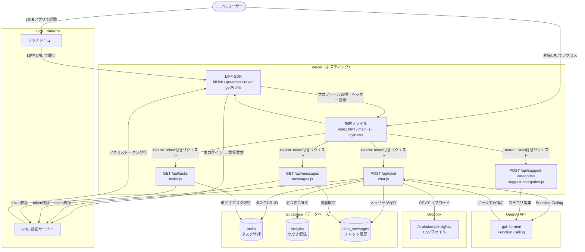

---

## 2. LIFF 認証フロー

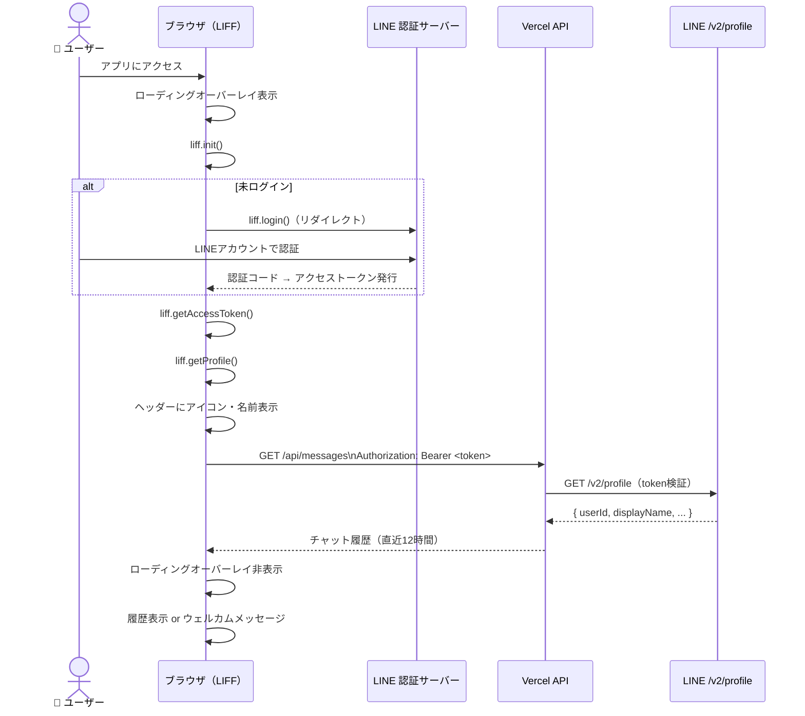

---

## 3. 通常チャット（AI処理）フロー

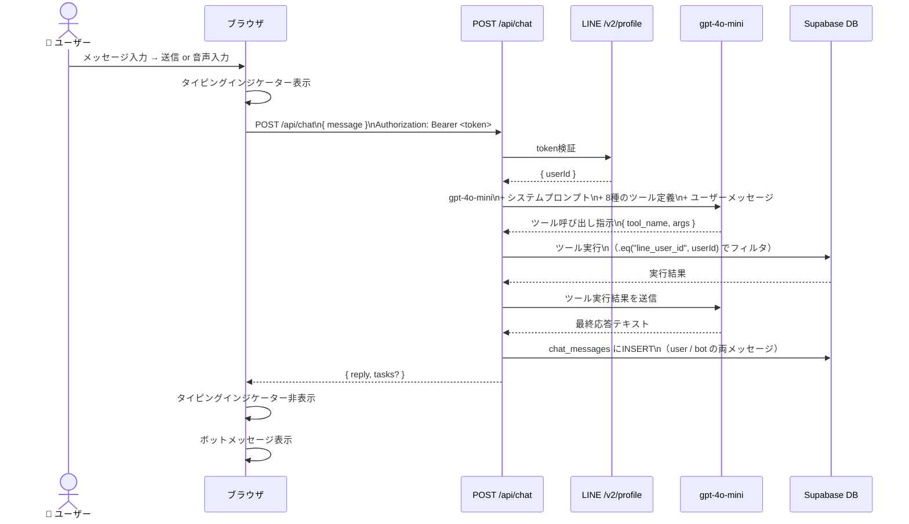

---

## 4. タスク管理ワークフロー

### 4.1 タスク追加

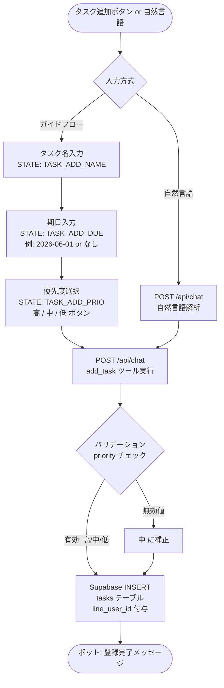

### 4.2 タスク完了

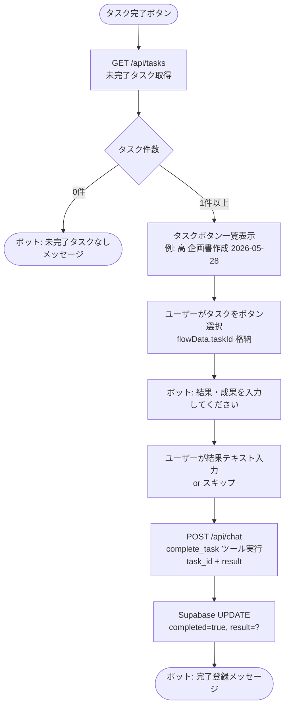

### 4.3 優先度修正

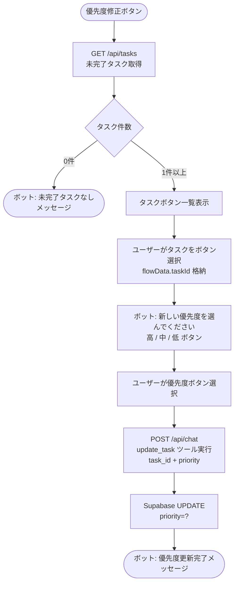

### 4.4 期日修正

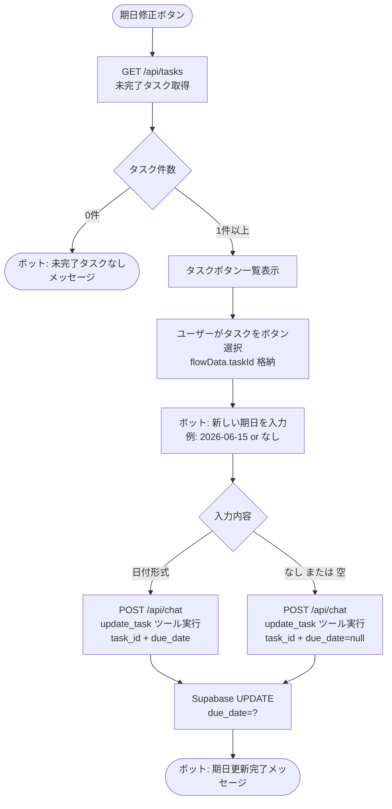

---

## 5. 気づき管理ワークフロー

### 5.1 気づき追加

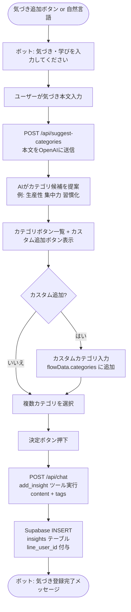

### 5.2 Dropbox エクスポート

```mermaid
flowchart TD
    A([気づきエクスポートボタン]) --> B[POST /api/chat\nexport_insights_to_dropbox ツール実行]
    B --> C[Supabase SELECT\nexported_at IS NULL\nかつ line_user_id=?]
    C --> D{未エクスポート件数}
    D -->|0件| E([ボット: エクスポート対象なしメッセージ])
    D -->|1件以上| F[CSV生成\nid, content, tags, created_at]
    F --> G[Dropbox SDK\nリフレッシュトークンで\n自動アクセストークン取得]
    G --> H[Dropbox filesUpload\n/braindump/insights/\ninsights_YYYYMMDD.csv]
    H --> I{アップロード結果}
    I -->|成功| J[Supabase UPDATE\nexported_at=now()]
    I -->|失敗| K([ボット: エラーメッセージ])
    J --> L([ボット: エクスポート完了メッセージ\nXX件をDropboxに保存])
```

---

## 6. 音声入力ワークフロー

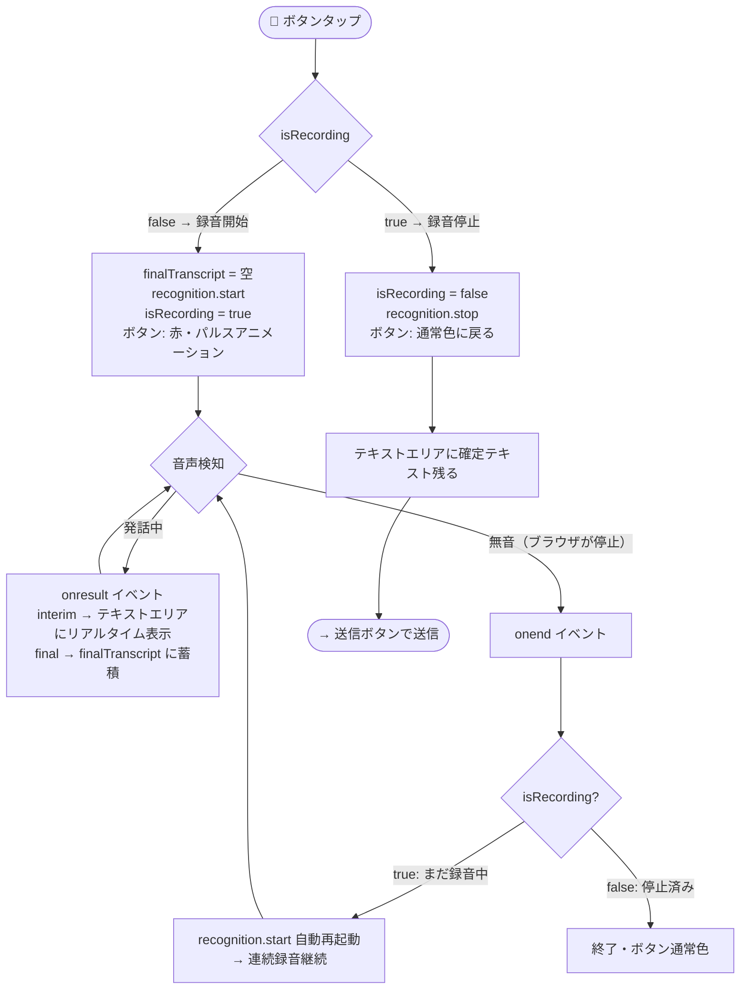

---

## 7. チャット履歴 保存・復元フロー

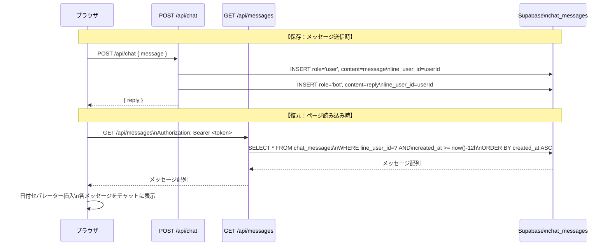

---

## 8. データ分離（マルチユーザー）の仕組み

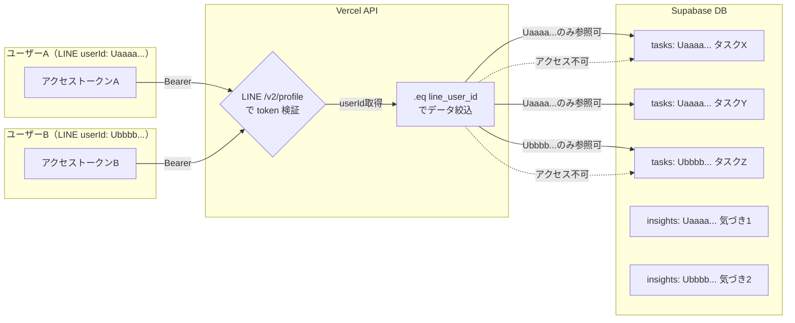

*ユーザーAは自分のデータ（Uaaaa...）のみ参照・更新できます。他ユーザーのデータには一切アクセスできません。*

---

## 8. B2B マルチテナント（2026-05-30）

```mermaid
flowchart LR
    Ops[運営] --> PC[platform-console.html]
    PC -->|POST organizations| APIP[/api/platform/*]
    APIP --> DB[(organizations / members / invites)]

    Rep[代表] -->|招待URL| LIFF[LIFF + activate]
    LIFF --> Auth[/api/auth/activate]
    Auth --> DB

    Rep --> Wiz[⚙️ 組織ウィザード 0〜3段]
    Wiz -->|POST setup 1回のみ| Org[/api/org/setup]
    Org --> DB

    User[メンバー] --> App[index.html]
    App -->|GET tasks| Tasks[/api/tasks + data-scope]
    Tasks --> DB
```

- **0段:** ウィザードのみ → 招待・⚙️ なし
- **org_admin:** `organization_id` で法人内全タスクを一覧可能
- 障害時チェックリスト: [11_Phase2_追補_2026-05-30.md](11_Phase2_追補_2026-05-30.md) §9
