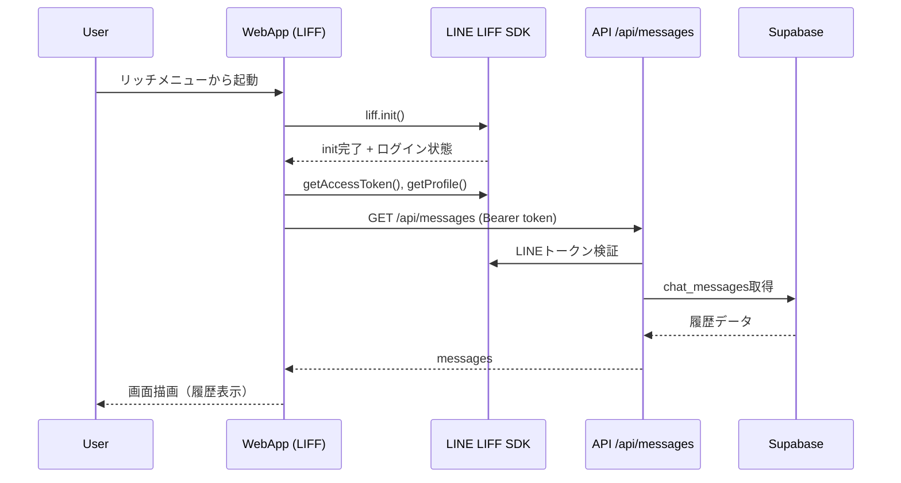
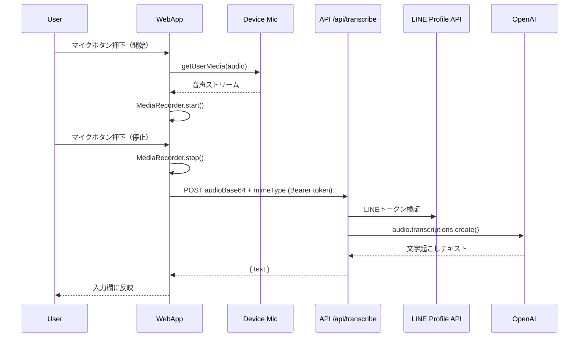
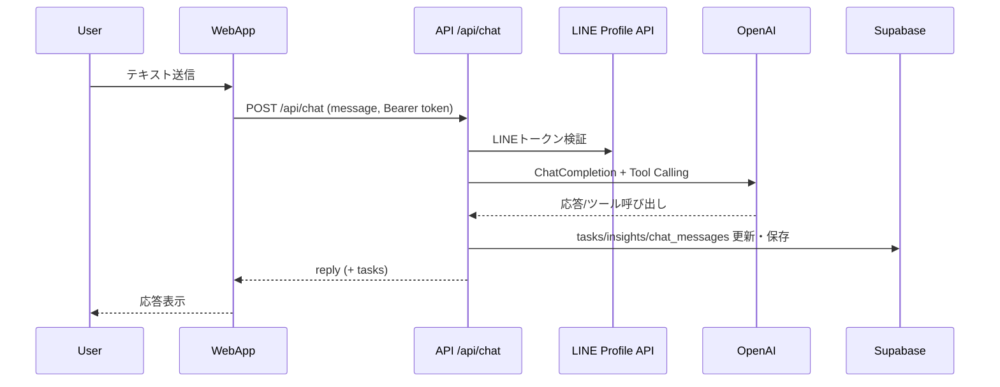

# BrainDump 仕様書

## 1. 文書情報

- システム名: BrainDump
- 文書名: 仕様書
- 対象バージョン: 音声入力を `MediaRecorder + サーバーSTT` へ切替後
- 最終更新日: 2026-05-24

## 2. システム概要

BrainDump は、LINE公式アカウントのリッチメニューから起動する LIFF Web アプリである。  
ユーザーはチャットUIでタスク管理と気づき記録を行い、音声入力にも対応する。

主な外部連携:

- LINE LIFF SDK（認証・プロフィール取得）
- Supabase（タスク・気づき・チャット履歴保存）
- OpenAI API（チャット応答、音声文字起こし）
- Dropbox（気づきCSVエクスポート）

## 3. 技術構成

### 3.1 フロントエンド

- 実装: Vanilla JavaScript / HTML / CSS
- 主ファイル:
  - `app/index.html`
  - `app/main.js`
  - `app/style.css`

### 3.2 バックエンド（Serverless API）

- 実装: Node.js（CommonJS）
- 配置: `api/*.js`
- 主API:
  - `api/chat.js`
  - `api/tasks.js`
  - `api/messages.js`
  - `api/suggest-categories.js`
  - `api/transcribe.js`
  - `api/config.js`

### 3.3 データストア

- Supabase
  - `tasks`
  - `insights`
  - `chat_messages`

## 4. 画面仕様

## 4.1 画面一覧

| 画面ID | 画面名 | 説明 |
|---|---|---|
| SCR-01 | チャット画面 | アプリの唯一のメイン画面。会話、クイック操作、音声入力を提供 |
| SCR-01-OL | ローディングオーバーレイ | LIFF初期化中に表示される全画面オーバーレイ |

## 4.2 SCR-01 チャット画面

### レイアウト構成

1. ヘッダー
   - アプリ名（BrainDump）
   - サブタイトル（Supabase × OpenAI）
   - LINEプロフィール（アイコン、表示名）
2. メッセージ領域
   - bot / user の吹き出し表示
   - 履歴セパレーター表示
3. クイックアクション領域
   - タスク追加 / 一覧 / 完了
   - 気づき追加 / エクスポート
   - 優先度修正 / 期日修正
4. 入力フッター
   - テキストエリア
   - マイクボタン
   - 送信ボタン

### 入力部品仕様

| 項目 | ID | 型 | 挙動 |
|---|---|---|---|
| メッセージ入力 | `user-input` | textarea | Enterで送信（Shift+Enterで改行） |
| 音声入力 | `mic-btn` | button | 1回目押下で録音開始、2回目押下で録音停止→文字起こし |
| 送信 | `send-btn` | button | 現在入力中のテキスト送信 |

### クイックアクション仕様

| ボタンID | 表示名 | 動作概要 |
|---|---|---|
| `qa-task` | ＋ タスク追加 | タスク追加フロー開始 |
| `qa-list` | 📋 タスク一覧 | 未完了一覧取得 |
| `qa-complete` | ✅ タスク完了 | 対象選択→結果入力→完了 |
| `qa-insight` | 💡 気づき追加 | 気づき入力→カテゴリ選択 |
| `qa-export` | 📤 気づきエクスポート | DropboxへCSV出力 |
| `qa-update-priority` | 🔄 優先度修正 | 対象選択→優先度更新 |
| `qa-update-due` | 📅 期日修正 | 対象選択→期日更新 |

## 4.3 SCR-01-OL ローディングオーバーレイ

| 項目 | 内容 |
|---|---|
| 表示条件 | LIFF初期化中 |
| 非表示条件 | `liff.init()` 成功後にプロフィール取得・履歴読み込み開始時 |
| エラー時 | オーバーレイを閉じ、チャットに認証エラーメッセージ表示 |

## 5. 機能仕様

## 5.1 認証・セッション

- クライアントで `liff.init({ liffId })`
- `liff.isLoggedIn()` が false の場合 `liff.login()`
- API呼び出し時に `Authorization: Bearer <accessToken>` を付与
- サーバーは LINE Profile API でトークン検証し `line_user_id` を取得

## 5.2 チャット処理

- `POST /api/chat` にユーザー発話を送信
- OpenAI の Function Calling でタスク/気づき操作を実行
- 応答を画面表示し、履歴を `chat_messages` に保存

## 5.3 音声入力（新方式）

### クライアント処理

- `navigator.mediaDevices.getUserMedia({ audio: true })` でマイク取得
- `MediaRecorder` で録音
- 停止時に Blob を Base64 化して `POST /api/transcribe`
- 返却されたテキストを `user-input` に反映

### サーバー処理

- LINEトークン検証後、受信した音声データを OpenAI へ送信
- モデル: `gpt-4o-mini-transcribe`
- 結果のテキストをクライアントへ返却

## 6. API仕様

## 6.1 共通仕様

- 認証ヘッダー: `Authorization: Bearer <LINE Access Token>`
- 文字コード: UTF-8
- レスポンス形式: JSON

## 6.2 API一覧

| メソッド | パス | 概要 |
|---|---|---|
| POST | `/api/chat` | チャット応答＋タスク/気づき操作 |
| GET | `/api/tasks` | タスク一覧取得 |
| GET | `/api/messages` | 直近会話履歴取得 |
| POST | `/api/suggest-categories` | 気づきカテゴリ候補提案 |
| POST | `/api/transcribe` | 音声文字起こし |
| GET | `/api/config` | フロント向け設定値取得 |

## 6.3 `POST /api/transcribe` 詳細

### リクエスト

```json
{
  "audioBase64": "<base64 encoded audio>",
  "mimeType": "audio/webm"
}
```

### レスポンス（成功）

```json
{
  "text": "文字起こし結果"
}
```

### レスポンス（失敗例）

```json
{
  "error": "文字起こしに失敗しました"
}
```

## 7. シーケンス図

## 7.1 アプリ起動（LIFF初期化）



## 7.2 音声入力（録音〜文字起こし）



## 7.3 テキスト送信（チャット）



## 8. エラーパターン表

## 8.1 音声入力関連

| No | 発生箇所 | 条件/エラー | ユーザー向け表示 | 対処 |
|---|---|---|---|---|
| A-01 | 録音開始 | `getUserMedia` 非対応 | 音声入力非対応メッセージ | テキスト入力へフォールバック |
| A-02 | 録音開始 | `NotAllowedError` | マイク権限確認メッセージ | LINE/端末権限を再確認 |
| A-03 | 録音開始 | `NotReadableError` / `AbortError` | マイク利用不可メッセージ | 通話・他録音アプリ停止後に再試行 |
| A-04 | 録音停止後 | Blobサイズ 0 | 録音データ取得失敗メッセージ | 再録音 |
| A-05 | 文字起こしAPI | `/api/transcribe` 4xx/5xx | 文字起こし失敗メッセージ | ネットワーク/サーバー状態確認 |
| A-06 | 文字起こし結果 | 空文字 | 認識不可メッセージ | 発話ボリューム・環境見直し |

## 8.2 API/認証関連

| No | 発生箇所 | 条件/エラー | API応答 | 対処 |
|---|---|---|---|---|
| B-01 | 全API | Authorization ヘッダーなし | `401` | LINEから再アクセス |
| B-02 | 全API | LINEトークン検証失敗 | `401` | 再ログイン・再起動 |
| B-03 | `/api/chat` | OpenAI or DB 失敗 | `500` | ログ確認後リトライ |
| B-04 | `/api/transcribe` | `audioBase64` 欠落 | `400` | クライアント送信データ確認 |
| B-05 | `/api/transcribe` | OpenAIキー未設定 | `500` | 環境変数設定 |

## 9. 非機能要件

- 可用性: API失敗時も画面操作が継続できること
- UX: エラー時にユーザーが次に取るべき行動が分かる文言を表示すること
- 保守性: APIごとに責務を分離し、トークン検証を統一すること
- セキュリティ: LINEアクセストークンをサーバー側で必ず検証すること

## 10. 既知の制約

- LINE内ブラウザは端末・OS依存差があり、録音挙動に差異が出る場合がある
- 音声認識精度は端末マイク品質・騒音環境・話速に依存する
- 大きすぎる音声データは転送/処理時間が増加するため、短文入力を推奨

