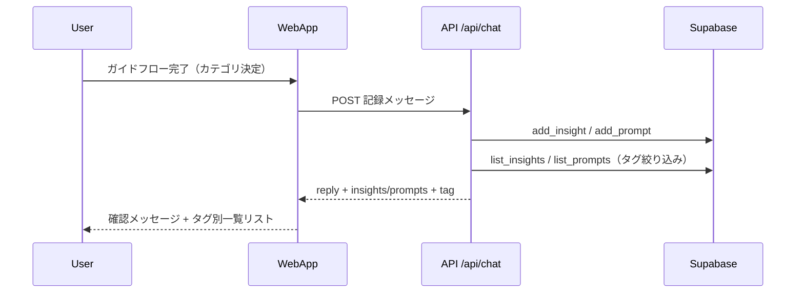

# BrainDump 仕様書

## 1. 文書情報

- システム名: BrainDump
- 文書名: 仕様書（サマリー）
- 対象バージョン: プロンプト保存・タグ別一覧表示対応後
- 最終更新日: 2026-07-11
- 詳細仕様: [docs/](docs/) 配下の各仕様書を参照

## 2. システム概要

BrainDump は、LINE公式アカウントのリッチメニューから起動する LIFF Web アプリである。  
ユーザーはチャットUIで **タスク管理**・**日々の気づき記録**・**プロンプト保存**・**朝ブリーフィング** を行い、音声入力にも対応する。

主な外部連携:

- LINE LIFF SDK（認証・プロフィール取得）
- Supabase（タスク・気づき・プロンプト・チャット履歴保存）
- OpenAI API（チャット応答、カテゴリ提案、音声文字起こし）
- Dropbox（気づきCSVエクスポート）

## 3. 技術構成

### 3.1 フロントエンド

- 実装: Vanilla JavaScript / HTML / CSS
- 主ファイル:
  - `app/index.html`
  - `app/main.js`
  - `app/style.css`

### 3.2 バックエンド（Serverless API）

- 実装: Node.js（CommonJS）
- 配置: `api/*.js`・`lib/*.js`
- 主API:
  - `api/chat.js`
  - `api/tasks.js`
  - `api/prompts.js`
  - `api/messages.js`
  - `api/suggest-categories.js`
  - `api/transcribe.js`
  - `api/config.js`

### 3.3 データストア

- Supabase
  - `tasks`
  - `insights`
  - `prompts`（Phase 3）
  - `briefing_logs`（Phase 4）
  - `chat_messages`
  - マルチテナント: `organizations` / `org_units` / `members` 等

## 4. 画面仕様

## 4.1 画面一覧

| 画面ID | 画面名 | 説明 |
|---|---|---|
| SCR-01 | チャット画面 | アプリのメイン画面。会話、クイック操作、音声入力を提供 |
| SCR-01-OL | ローディングオーバーレイ | LIFF初期化中に表示される全画面オーバーレイ |
| SCR-02 | 組織管理オーバーレイ | 代表の組織設定・招待（条件付き） |
| SCR-03 | 運営コンソール | 法人登録・代表招待 |

## 4.2 SCR-01 チャット画面

### レイアウト構成

1. ヘッダー
   - アプリ名（BrainDump）
   - サブタイトル（Supabase × OpenAI）
   - 組織管理 ⚙️（条件付き）
   - 法人名（`organizations.name`）
   - LINEプロフィール（表示名、アイコン）
2. メッセージ領域
   - bot / user の吹き出し表示
   - 構造化リスト（タスク・気づき・プロンプト）
   - 履歴セパレーター表示
3. クイックアクション領域（9ボタン）
   - タスク追加 / 一覧 / 完了
   - 気づき追加 / プロンプト追加 / エクスポート
   - 朝ブリーフィング
   - 優先度修正 / 期日修正
4. 入力フッター
   - テキストエリア
   - マイクボタン
   - 送信ボタン

### クイックアクション仕様

| ボタンID | 表示名 | 動作概要 |
|---|---|---|
| `qa-task` | ＋ タスク追加 | タスク追加フロー開始 |
| `qa-list` | 📋 タスク一覧 | 未完了一覧取得（`GET /api/tasks`） |
| `qa-complete` | ✅ タスク完了 | 対象選択→結果入力→完了（`PATCH /api/tasks`） |
| `qa-insight` | 💡 気づき追加 | 気づき入力→カテゴリ選択→タグ別一覧表示 |
| `qa-prompt` | ✨ プロンプト追加 | タイトル→本文→カテゴリ選択→タグ別一覧表示 |
| `qa-export` | 📤 気づきエクスポート | DropboxへCSV出力 |
| `qa-briefing` | 🌅 朝ブリーフィング | 未完了タスクを要約して `briefing_logs` に保存 |
| `qa-update-priority` | 🔄 優先度修正 | 対象選択→優先度更新 |
| `qa-update-due` | 📅 期日修正 | 対象選択→期日更新 |

## 5. 機能仕様（サマリー）

| 領域 | 概要 |
|------|------|
| タスク | ガイドフローまたは自然言語で追加。一覧は色付きバッジ表示 |
| 気づき | 本文＋タグで記録。登録後に選択タグ（未選択時は「アイデア」）で一覧を標準表示 |
| プロンプト | タイトル・本文・タグで記録。登録後に選択タグ（未選択時は「文章作成」）で一覧を標準表示 |
| 朝ブリーフィング | 未完了タスクを AI が要約し `briefing_logs` に日付単位で保存（同日は上書き） |
| 音声入力 | `MediaRecorder` で録音 → `POST /api/transcribe` で文字起こし |
| マルチテナント | `lib/data-scope.js` による法人・ロール別スコープ |

## 6. API仕様（サマリー）

| メソッド | パス | 概要 |
|---|---|---|
| POST | `/api/chat` | チャット応答＋タスク/気づき/プロンプト操作 |
| GET | `/api/tasks` | タスク一覧取得 |
| POST | `/api/tasks` | タスク直接追加 |
| PATCH | `/api/tasks` | タスク完了 |
| GET | `/api/prompts` | プロンプト一覧取得（`tag` クエリで絞り込み可） |
| POST | `/api/prompts` | プロンプト直接追加 |
| GET | `/api/messages` | 直近会話履歴取得 |
| POST | `/api/suggest-categories` | カテゴリ候補提案（`type: insight \| prompt`） |
| POST | `/api/transcribe` | 音声文字起こし |
| GET | `/api/config` | フロント向け設定値取得 |

### `POST /api/chat` レスポンス（拡張フィールド）

```json
{
  "reply": "記録したよ！",
  "tasks": [],
  "insights": [],
  "insightTag": "アイデア",
  "prompts": [],
  "promptTag": "文章作成"
}
```

`tasks` / `insights` / `prompts` は該当ツール実行時のみ付与。

## 7. シーケンス図

## 7.1 気づき・プロンプト登録後の一覧表示



## 8. データベース（Phase 3 追加分）

### `prompts` テーブル

| カラム | 型 | 説明 |
|--------|-----|------|
| `id` | uuid | PK |
| `title` | text | プロンプト名（必須） |
| `content` | text | プロンプト本文（必須） |
| `tags` | text | カンマ区切りタグ |
| `line_user_id` | text | LINEユーザーID |
| `organization_id` | uuid | 法人（Phase 2） |
| `org_unit_id` | uuid | 所属組織 |
| `member_id` | uuid | 作成メンバー |
| `created_at` | timestamptz | 作成日時 |

DDL: `SQL/phase3_prompts.sql`（Supabase SQL Editor で実行）

## 9. エラーパターン表

## 9.1 音声入力関連

| No | 発生箇所 | 条件/エラー | ユーザー向け表示 | 対処 |
|---|---|---|---|---|
| A-01 | 録音開始 | `getUserMedia` 非対応 | 音声入力非対応メッセージ | テキスト入力へフォールバック |
| A-02 | 録音開始 | `NotAllowedError` | マイク権限確認メッセージ | LINE/端末権限を再確認 |
| A-03 | 録音開始 | `NotReadableError` / `AbortError` | マイク利用不可メッセージ | 通話・他録音アプリ停止後に再試行 |
| A-04 | 録音停止後 | Blobサイズ 0 | 録音データ取得失敗メッセージ | 再録音 |
| A-05 | 文字起こしAPI | `/api/transcribe` 4xx/5xx | 文字起こし失敗メッセージ | ネットワーク/サーバー状態確認 |
| A-06 | 文字起こし結果 | 空文字 | 認識不可メッセージ | 発話ボリューム・環境見直し |

## 9.2 API/認証関連

| No | 発生箇所 | 条件/エラー | API応答 | 対処 |
|---|---|---|---|---|
| B-01 | 全API | Authorization ヘッダーなし | `401` | LINEから再アクセス |
| B-02 | 全API | LINEトークン検証失敗 | `401` | 再ログイン・再起動 |
| B-03 | `/api/chat` | OpenAI or DB 失敗 | `500` | ログ確認後リトライ |
| B-04 | `/api/prompts` | `prompts` テーブル未作成 | `500` | `phase3_prompts.sql` を実行 |

## 10. 非機能要件

- 可用性: API失敗時も画面操作が継続できること
- UX: エラー時にユーザーが次に取るべき行動が分かる文言を表示すること
- 保守性: APIごとに責務を分離し、トークン検証を統一すること
- セキュリティ: LINEアクセストークンをサーバー側で必ず検証すること

## 11. 関連ドキュメント

| 文書 | 内容 |
|------|------|
| [docs/01_要求仕様書.md](docs/01_要求仕様書.md) | 要求・ユースケース |
| [docs/02_システム仕様書.md](docs/02_システム仕様書.md) | システム構成・データフロー |
| [docs/03_DB仕様書.md](docs/03_DB仕様書.md) | テーブル定義・DDL |
| [docs/04_画面仕様書.md](docs/04_画面仕様書.md) | 画面・UIコンポーネント |
| [docs/05_機能仕様書.md](docs/05_機能仕様書.md) | 機能一覧・詳細 |
| [docs/06_API仕様書.md](docs/06_API仕様書.md) | API・ツール定義 |
| [docs/07_UIフロー仕様書.md](docs/07_UIフロー仕様書.md) | ステートマシン・フロー |
| [docs/09_Phase1_マルチテナント.md](docs/09_Phase1_マルチテナント.md) | Phase 1 |
| [docs/10_Phase2_組織階層.md](docs/10_Phase2_組織階層.md) | Phase 2 |
| [docs/11_Phase2_追補_2026-05-30.md](docs/11_Phase2_追補_2026-05-30.md) | Phase 2 追補 |
